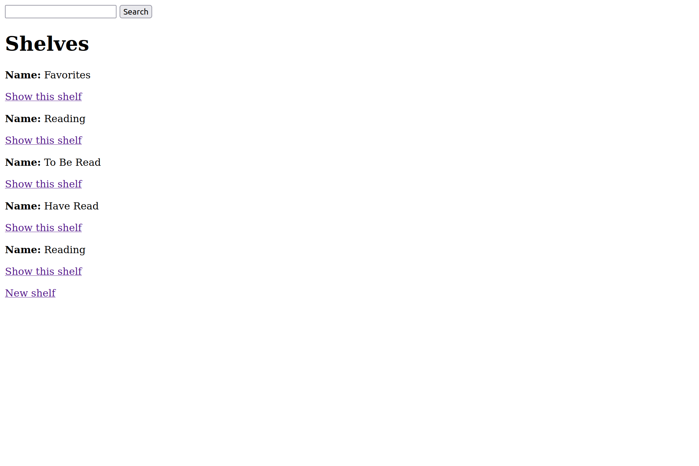

# A Reading Log Website

A demo of a Reading log website. This is a redo of my previous Reading Log website, which didn't work. I am currently adding more features to it. Feedback is most welcome :)

## Code Overview

The file composition of the code consists of:

- Ruby on Rails
- PostgreSQL

## Gems Used

- Google Books API
- Google Authentication

### Future Improvements

- Better UI Design
- More functionality

## Acknowledgements

Thank you to [Joel](https://github.com/wofockham) and [Loden](https://github.com/Tenzang) for all the debugging, and suggestions from my previous attempt :D
